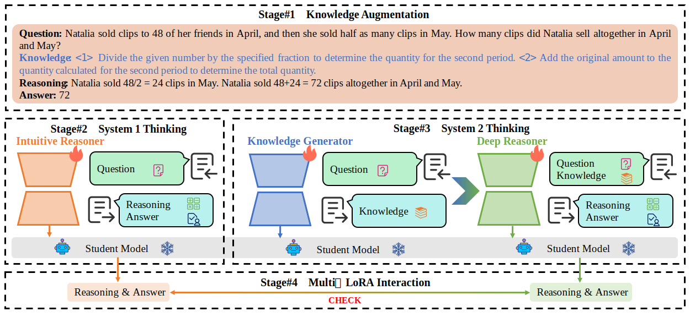

# LoRID

<p align="center">
📃 <a href="https://arxiv.org/abs/2508.13037" target="_blank">Paper</a> • 💻 <a href="https://github.com/Xinhe-Li/LoRID" target="_blank">Code</a> • 🤗 <a href="https://huggingface.co/LoRID-Math" target="_blank">HF Repo</a><br>
</p>

## Abstract

The codes and datasets for "[Can Large Models Teach Student Models to Solve Mathematical Problems Like Human Beings? A Reasoning Distillation Method via Multi-LoRA Interaction](https://arxiv.org/abs/2508.13037)" [IJCAI 2025].




## Key Contributions

- We focus on the mathematical reasoning distillation task and propose a novel method **LoRID**, which draws inspiration from the human beings teaching and learning pattern.
- We introduce knowledge during data augmentation and propose multi-LoRA interaction during model distillation, which improves the student’s reasoning abilities.
- Experimental results show that with the interaction between System 1 and System 2, **LoRID** outperforms previous state-of-the-art approaches and can be easily and effectively integrated into any Chain-of-Thought distillation method.


## Installation

All experiments are implemented on the NVIDIA A100 GPU with the PyTorch. The version of Python is 3.12.

Please run as follows to install all the dependencies:

```bash
# Clone the repository
git clone https://github.com/Xinhe-Li/LoRID.git
cd LoRID/LLaMA-Factory

# Create conda environment
conda create -n lorid python=3.12
conda activate lorid

# Install dependencies
pip install -e ".[torch,metrics,vllm]"
pip install openai latex2sympy2 word2number

cd ..
```

## Model Checkpoints

| LoRA Block                                                        | Module              | Dataset                                                      | Base Model                                                   | Acc   |
| ------------------------------------------------------------ | ------------------- | ------------------------------------------------------------ | ------------------------------------------------------------ | ----- |
| 🤗 [LoRID-GSM8K-LLaMA-2-7B-IR](https://huggingface.co/LoRID-Math/GSM8K-LLaMA-2-7B-IR) | Intuitive Reasoner  | [MetaMathQA](https://huggingface.co/datasets/meta-math/MetaMathQA) | [LLaMA-2-7B](https://huggingface.co/meta-llama/Llama-2-7b-hf) | 0.726 |
| 🤗 [LoRID-GSM8K-LLaMA-2-7B-KG](https://huggingface.co/LoRID-Math/GSM8K-LLaMA-2-7B-KG) | Knowledge Generator | 🤗 [LoRID-GSM8K](https://huggingface.co/datasets/LoRID-Math/GSM8K) | [LLaMA-2-7B](https://huggingface.co/meta-llama/Llama-2-7b-hf) | 0.726 |
| 🤗 [LoRID-GSM8K-LLaMA-2-7B-DR](https://huggingface.co/LoRID-Math/GSM8K-LLaMA-2-7B-DR) | Deep Reasoner       | 🤗 [LoRID-GSM8K](https://huggingface.co/datasets/LoRID-Math/GSM8K) | [LLaMA-2-7B](https://huggingface.co/meta-llama/Llama-2-7b-hf) | 0.726 |
| 🤗 [LoRID-GSM8K-Mistral-7B-IR](https://huggingface.co/LoRID-Math/GSM8K-Mistral-7B-IR) | Intuitive Reasoner  | [MetaMathQA](https://huggingface.co/datasets/meta-math/MetaMathQA) | [Mistral-7B](https://huggingface.co/mistralai/Mistral-7B-v0.1) | 0.785 |
| 🤗 [LoRID-GSM8K-Mistral-7B-KG](https://huggingface.co/LoRID-Math/GSM8K-Mistral-7B-KG) | Knowledge Generator | 🤗 [LoRID-GSM8K](https://huggingface.co/datasets/LoRID-Math/GSM8K) | [Mistral-7B](https://huggingface.co/mistralai/Mistral-7B-v0.1) | 0.785 |
| 🤗 [LoRID-GSM8K-Mistral-7B-DR](https://huggingface.co/LoRID-Math/GSM8K-Mistral-7B-DR) | Deep Reasoner       | 🤗 [LoRID-GSM8K](https://huggingface.co/datasets/LoRID-Math/GSM8K) | [Mistral-7B](https://huggingface.co/mistralai/Mistral-7B-v0.1) | 0.785 |
| 🤗 [LoRID-MATH-LLaMA-2-7B-IR](https://huggingface.co/LoRID-Math/MATH-LLaMA-2-7B-IR) | Intuitive Reasoner  | [MetaMathQA](https://huggingface.co/datasets/meta-math/MetaMathQA) | [LLaMA-2-7B](https://huggingface.co/meta-llama/Llama-2-7b-hf) | 0.203 |
| 🤗 [LoRID-MATH-LLaMA-2-7B-KG](https://huggingface.co/LoRID-Math/MATH-LLaMA-2-7B-KG) | Knowledge Generator | 🤗 [LoRID-MATH](https://huggingface.co/datasets/LoRID-Math/MATH) | [LLaMA-2-7B](https://huggingface.co/meta-llama/Llama-2-7b-hf) | 0.203 |
| 🤗 [LoRID-MATH-LLaMA-2-7B-DR](https://huggingface.co/LoRID-Math/MATH-LLaMA-2-7B-DR) | Deep Reasoner       | 🤗 [LoRID-MATH](https://huggingface.co/datasets/LoRID-Math/MATH) | [LLaMA-2-7B](https://huggingface.co/meta-llama/Llama-2-7b-hf) | 0.203 |
| 🤗 [LoRID-MATH-Mistral-7B-IR](https://huggingface.co/LoRID-Math/MATH-Mistral-7B-IR) | Intuitive Reasoner  | [MetaMathQA](https://huggingface.co/datasets/meta-math/MetaMathQA) | [Mistral-7B](https://huggingface.co/mistralai/Mistral-7B-v0.1) | 0.316 |
| 🤗 [LoRID-MATH-Mistral-7B-KG](https://huggingface.co/LoRID-Math/MATH-Mistral-7B-KG) | Knowledge Generator | 🤗 [LoRID-MATH](https://huggingface.co/datasets/LoRID-Math/MATH) | [Mistral-7B](https://huggingface.co/mistralai/Mistral-7B-v0.1) | 0.316 |
| 🤗 [LoRID-MATH-Mistral-7B-DR](https://huggingface.co/LoRID-Math/MATH-Mistral-7B-DR) | Deep Reasoner       | 🤗 [LoRID-MATH](https://huggingface.co/datasets/LoRID-Math/MATH) | [Mistral-7B](https://huggingface.co/mistralai/Mistral-7B-v0.1) | 0.316 |

> [!NOTE]
> For the Intuition Reasoner, we only release the LoRA weights based on [MetaMathQA](https://huggingface.co/datasets/meta-math/MetaMathQA). You can also leverage [RFT](https://github.com/OFA-Sys/gsm8k-ScRel/tree/main/data/rft), [MuMath](https://huggingface.co/datasets/weihao1/MuMath), [MuggleMath](https://github.com/OFA-Sys/gsm8k-ScRel/tree/main/data/MuggleMATH), or other datasets to further improve LoRID performance. Detailed results are provided in our paper.
> 
> We only release the LoRA weights built on [LLaMA-2-7B](https://huggingface.co/meta-llama/Llama-2-7b-hf) and [Mistral-7B](https://huggingface.co/mistralai/Mistral-7B-v0.1). Results for [LLaMA-3-8B](https://huggingface.co/meta-llama/Meta-Llama-3-8B), [Qwen2.5Math-7B](https://huggingface.co/Qwen/Qwen2.5-Math-7B), and [DeepSeekMath-7B](https://huggingface.co/deepseek-ai/deepseek-math-7b-base) are provided in our paper.
>
> After downloading our LoRA weights from Hugging Face, merge them with the base model before running evaluation. 

## Quick Start

### Data Preparation

Use GPT-4o for knowledge augmentation, with the GSM8K dataset as an example:

```bash
bash examples/gsm8k/gen_data.sh
```

> [!NOTE]
> Replace the values of `OPENAI_API_BASE` and `OPENAI_API_KEY` in [gen_data.sh](examples/gsm8k/gen_data.sh) according to your own setup. The file specified by the `--raw_dataset_path` must contain at least the keys `id`, `question`, and `rationale`. These can be easily extracted from the [GSM8K](https://huggingface.co/datasets/openai/gsm8k) or [MATH](https://huggingface.co/datasets/EleutherAI/hendrycks_math) datasets, but you are also free to experiment with others.
>
> In our experiments, to increase the amount of training data, we map the generated knowledge to entries in [MetaMathQA](https://huggingface.co/datasets/meta-math/MetaMathQA), resulting in two datasets: 🤗 [LoRIA-GSM8K](https://huggingface.co/datasets/LoRID-Math/GSM8K) and 🤗 [LoRID-MATH](https://huggingface.co/datasets/LoRID-Math/MATH).

### Training

Train the Intuitive Reasoner, Knowledge Generator, and Deep Reasoner LoRA blocks:

```bash
# Train Intuitive Reasoner
bash examples/gsm8k/llama2/train_IR.sh

# Train Knowledge Generator
bash examples/gsm8k/llama2/train_KG.sh

# Train Deep Reasoner
bash examples/gsm8k/llama2/train_DR.sh
```

> [!NOTE]
> Ensure that the folder specified by `--output_dir_model` has enough disk space to store the merged LoRA and base model.

### Evaluation

Evaluate the mathematical reasoning ability of LoRID:

```bash
bash examples/gsm8k/llama2/predict.sh
```

## Results

Accuracy results (%) of the compared methods on GSM8K and MATH datasets (ICL: In-context learning, SFT: Supervised finetuning on the training set of GSM8K or MATH).

| Method                    | Base model   | #params | GSM8K    | MATH     |
| ------------------------- | ------------ | ------- | -------- | -------- |
| ICL                       | LLaMA-2      | 7B      | 14.6     | 2.5      |
| SFT                       | LLaMA-2      | 7B      | 41.6     | 7.2      |
| RFT [Arxiv 2023]          | LLaMA-2      | 7B      | 51.2     | --       |
| MetaMath [ICLR 2024]      | LLaMA-2      | 7B      | 66.5     | 19.8     |
| QDMR [COLING 2024]        | LLaMA-2      | 7B      | 30.4     | --       |
| AutoPRM [NAACL 2024]      | LLaMA-2      | 7B      | 70.8     | 23.6     |
| MuMath [NAACL 2024]       | LLaMA-2      | 7B      | 76.2     | 23.3     |
| MathScale [ICML 2024]     | LLaMA-2      | 7B      | 66.3     | **31.1** |
| R<sup>3</sup> [ICML 2024] | LLaMA-2      | 7B      | 50.5     | --       |
| MFT [ACL 2024]            | LLaMA-2      | 7B      | 69.0     | 20.8     |
| Math-Shepherd [ACL 2024]  | LLaMA-2      | 7B      | 73.2     | 21.6     |
| MuggleMath [ACL 2024]     | LLaMA-2      | 7B      | 69.8     | 23.1     |
| DPO-ST [ACL 2024]         | LLaMA-2      | 7B      | 54.7     | --       |
| **🔥 LoRID [IJCAI 2025]**  | LLaMA-2      | 7B      | **78.5** | 25.2     |
| ICL                       | LLaMA-3      | 8B      | 58.4     | 17.0     |
| SFT                       | LLaMA-3      | 8B      | 60.9     | 18.1     |
| DPO-ST [ACL 2024]         | LLaMA-3      | 8B      | 68.8     | --       |
| AlphaMath [NeurIPS 2024]  | LLaMA-3      | 8B      | 71.8     | 41.9     |
| **🔥 LoRID [IJCAI 2025]**  | LLaMA-3      | 8B      | **87.9** | **44.7** |
| ICL                       | Mistral      | 7B      | 15.5     | 10.1     |
| SFT                       | Mistral      | 7B      | 50.3     | 13.4     |
| MetaMath [ICLR 2024]      | Mistral      | 7B      | 77.7     | 28.2     |
| MathScale [ICML 2024]     | Mistral      | 7B      | 74.8     | 35.2     |
| MFT [ACL 2024]            | Mistral      | 7B      | 79.5     | 29.0     |
| Math-Shepherd [ACL 2024]  | Mistral      | 7B      | 81.8     | 33.0     |
| RefAug [EMNLP 2024]       | Mistral      | 7B      | 78.9     | 30.1     |
| Self-Refine [EMNLP 2024]  | Mistral      | 7B      | 71.6     | --       |
| **🔥 LoRID [IJCAI 2025]**  | Mistral      | 7B      | **84.2** | **38.7** |
| ICL                       | Qwen2.5-Math | 7B      | 57.7     | 52.1     |
| SFT                       | Qwen2.5-Math | 7B      | 79.4     | 49.1     |
| **🔥 LoRID [IJCAI 2025]**  | Qwen2.5-Math | 7B      | **91.7** | **61.2** |
| ICL                       | DeepSeekMath | 7B      | 65.7     | 33.4     |
| SFT                       | DeepSeekMath | 7B      | 67.2     | 30.9     |
| DART-Math [NeurIPS 2024]  | DeepSeekMath | 7B      | 88.2     | 52.9     |
| **🔥 LoRID [IJCAI 2025]**  | DeepSeekMath | 7B      | **90.0** | **54.8** |


## Citation

If this work is helpful, please kindly cite as:

```bibtex
@misc{li2025largemodelsteachstudent,
      title={Can Large Models Teach Student Models to Solve Mathematical Problems Like Human Beings? A Reasoning Distillation Method via Multi-LoRA Interaction}, 
      author={Xinhe Li and Jiajun Liu and Peng Wang},
      year={2025},
      eprint={2508.13037},
      archivePrefix={arXiv},
      primaryClass={cs.CL},
      url={https://arxiv.org/abs/2508.13037}, 
}
```

## License

This repository is licensed under the [Apache-2.0 License](LICENSE).

Please follow the model licenses to use the corresponding model weights: [Llama 2](https://ai.meta.com/llama/license/) / [Llama 3](https://llama.meta.com/llama3/license/) / [Mistral](LICENSE) / [Qwen2.5-Math](LICENSE) / [DeepSeekMath](https://github.com/deepseek-ai/DeepSeek-LLM/blob/main/LICENSE-MODEL).

## Acknowledgements

This repo benefits from [LLaMA-Factory](https://github.com/hiyouga/LLaMA-Factory) and [Qwen2.5-Math](https://github.com/QwenLM/Qwen2.5-Math). Thanks for their wonderful works.
